<div align="center">

# 智派家教 · Smart Tutor

**多租户家教订单匹配平台 —— 从微信聊天记录到成交打款的全链路数字化**

中介批量发单 · 教员地图找单 · 试课定金尾款全流程 · 信用画像驱动推荐

[](https://github.com/lii-lii321/smart_tutor/actions/workflows/ci.yml)


</div>

---

## 界面速览

| 教员端（H5） | 智能推荐 |
|:---:|:---:|
| 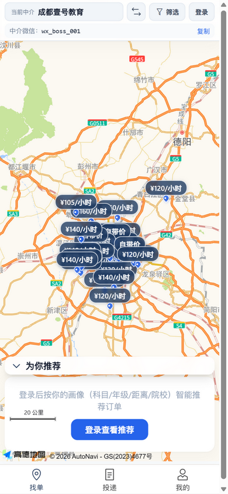 | 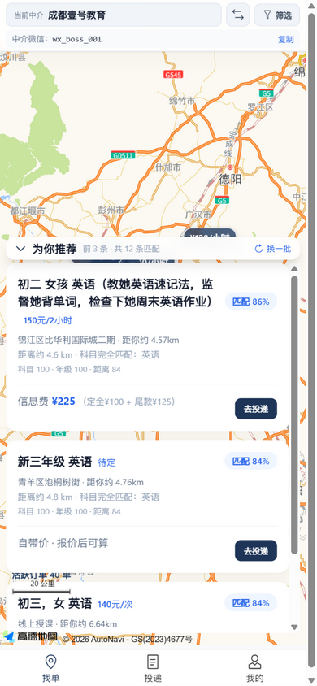 |
| *公开橱窗：地图看单 + 中介微信一键复制* | *按科目/年级/距离/院校智能排序，标注匹配度* |

| 投递审核（B 端） | 经营看板（老板端） |
|:---:|:---:|
| 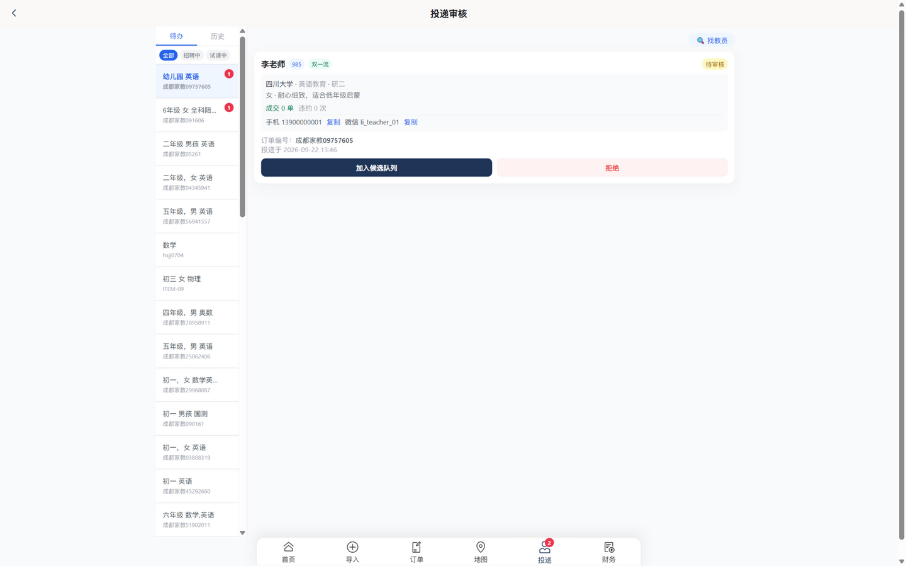 | 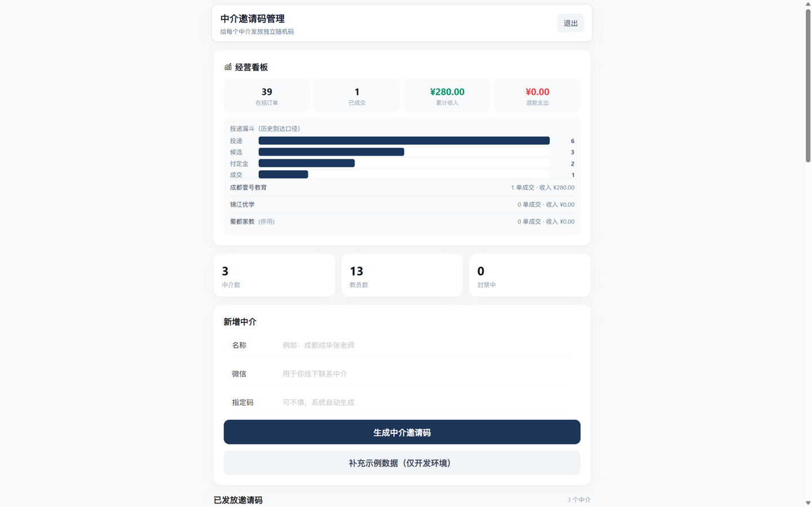 |
| *教员联系方式一键复制，信用画像辅助决策* | *投递漏斗、中介排行、资金总览* |

| AI 批量导入 | 财务流水 |
|:---:|:---:|
| 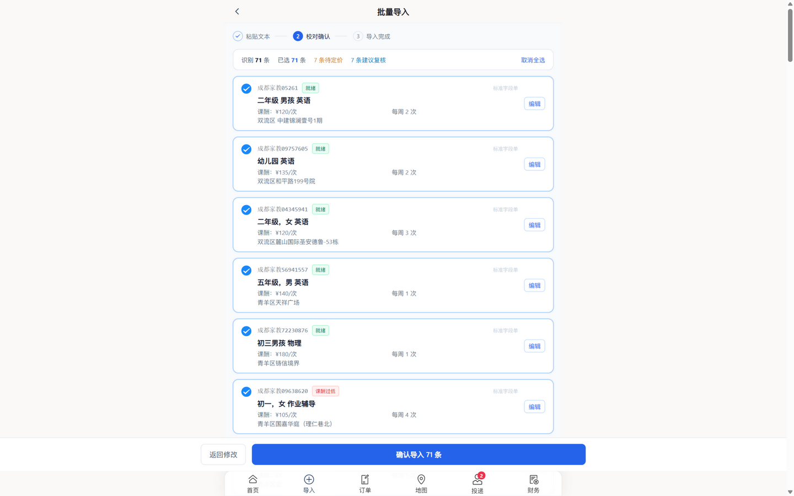 | 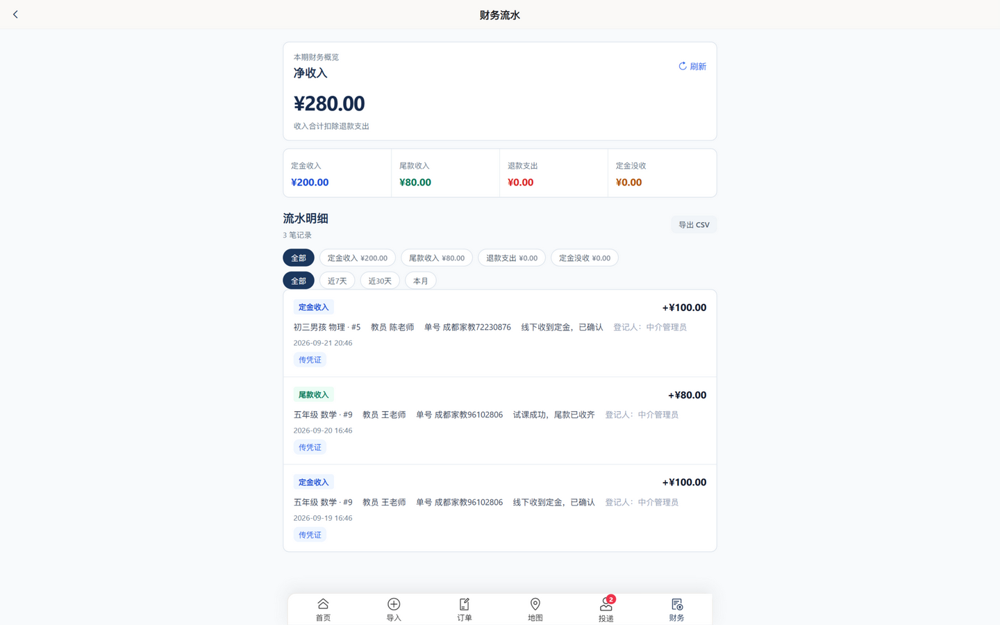 |
| *粘贴微信聊天文本，AI 识别字段后逐条校对* | *定金/尾款/退款/没收全类型台账，按筛选导出 CSV* |

<details>
<summary>更多界面</summary>

| 统一登录 | 教员注册（密码强度实时检查） |
|:---:|:---:|
| 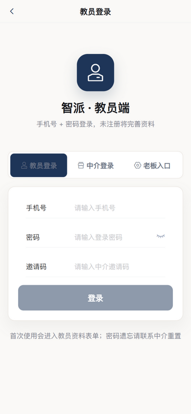 | 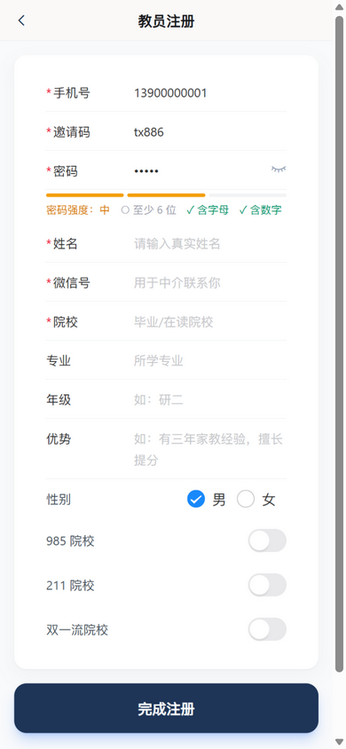 |

| 我的投递 | 个人中心 | 编辑资料 |
|:---:|:---:|:---:|
| 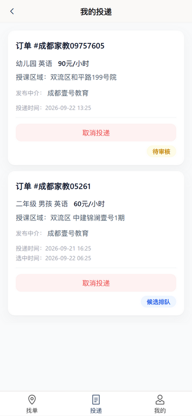 | 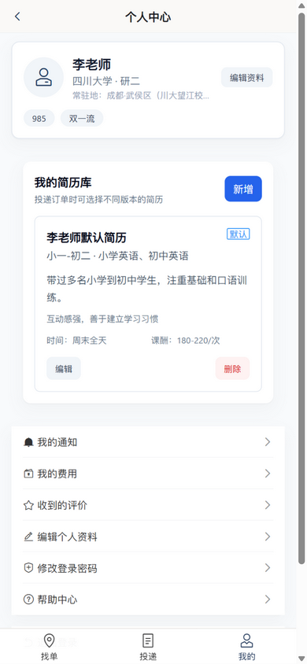 | 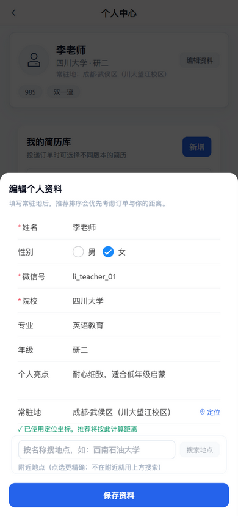 |

| 中介工作台 |
|:---:|
| 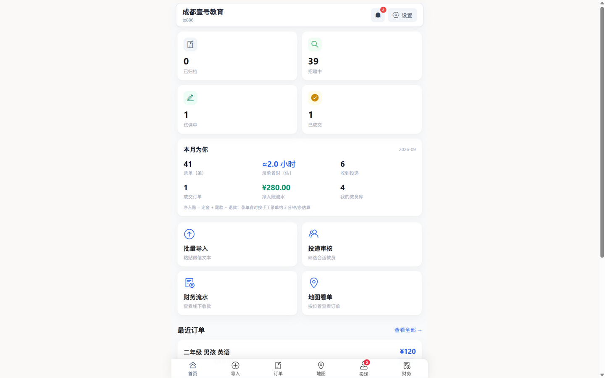 |

</details>

## 它解决什么问题

家教中介的日常困在微信里：订单信息靠刷屏、教员简历靠翻聊天记录、定金尾款靠脑子记。
Smart Tutor 把这条链路搬到了线上：

1. **中介**把微信聊天里复制的订单文本整段粘贴，AI 自动识别年级/科目/课酬/地址并完成地理编码，逐条校对后一键上架；
2. **教员**打开中介专属橱窗，在地图上找单，系统按科目、年级、距离（常驻地）、院校标签、历史成交智能推荐；
3. 投递 → 候选 → **线下收定金** → 试课 → 尾款 → 成交，每一步都有状态机守卫与资金流水；
4. 成交后中介给教员打分，**信用画像**回流到推荐排序，形成正向筛选。

## 三端角色

| 角色 | 入口 | 核心能力 |
|---|---|---|
| **教员**（C 端 H5） | `/teacher/board/{邀请码}` | 手机号+密码登录；地图找单、个性化推荐、投递/取消、试课后解锁家长联系方式、通知、我的费用、收到的评价、资料与简历库自助维护 |
| **中介**（B 端后台） | `/admin/login` | AI 批量导入订单、投递审核全流程、订单/地图管理、财务流水（筛选/导出）、教员管理与拉黑、站内通知 |
| **平台老板** | 教员登录页 → 老板入口 | 中介/邀请码管理（一次性初始密码、重置）、教员全局封禁、经营看板（漏斗/排行/GMV） |

## 业务闭环

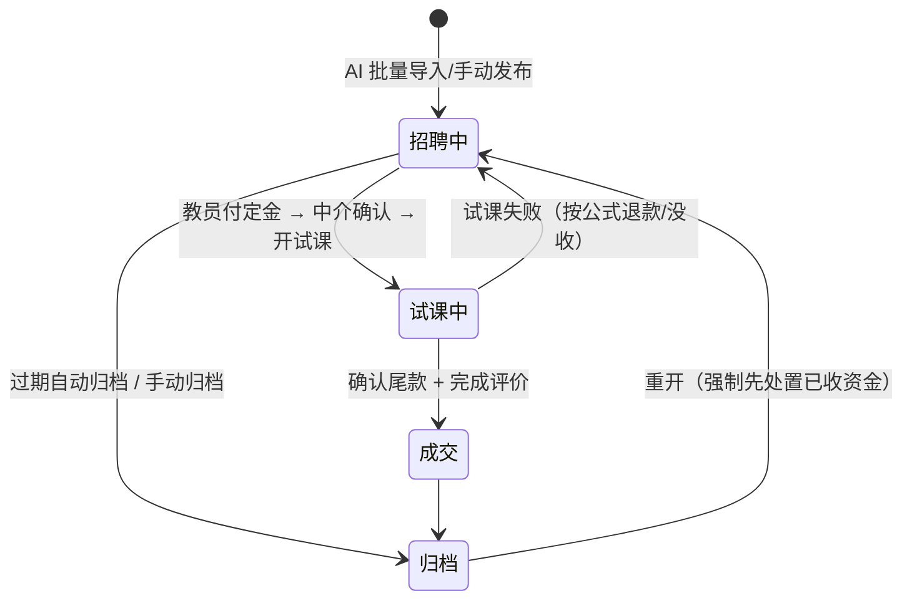

- **投递状态机**：待审核 → 候选 → 定金已付 → 试课中 → 尾款已付 → 成交/拒绝/退款，全端点状态前置校验 + 订单行锁，杜绝并发复活已完结订单。
- **资金台账**（线下收款模式）：定金 → 尾款 → 退款/没收，每笔登记操作人与订单，净收入公式保证台账守恒；退款封顶实收、零退款强制补记没收。
- **信用体系**：成交数 / 违约数 / 评价均分批量聚合，进入投递列表与推荐排序；中介级黑名单 + 平台级封禁双层拦截。
- **通知闭环**：教员（投递流转/评价）+ 中介（新投递/取消投递/订单临期）双通道站内通知，未读角标。

## 架构

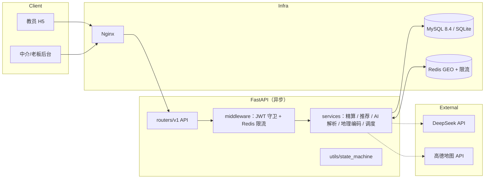

**技术栈**：FastAPI（异步）+ SQLAlchemy 2 + Pydantic v2 · Vue 3 + Vite + TypeScript + Vant + Tailwind · MySQL / SQLite · Redis · JWT · Alembic · Docker · GitHub Actions

## 快速开始（本地开发）

```bash
# 1. 后端（Python 3.11+）
pip install -r requirements-dev.txt
#    .env 中设置 DEV_MODE=true 后启动：自动建表并播种演示数据
uvicorn main:app --reload --port 8000

# 2. 前端（Node 20+）
cd frontend
npm install
npm run dev   # http://127.0.0.1:5173
```

演示账号（DEV_MODE 播种，密码均为 `dev123456`）：

| 角色 | 凭证 |
|---|---|
| 中介 | 邀请码 `tx886` |
| 教员 | 手机号 `13900000001`（王/陈/刘老师为 `…002/003/004`） |
| 平台老板 | 访问码 `boss888`（生产必须改） |

## 生产部署

见 [DEPLOY.md](DEPLOY.md)。概要：

```bash
docker compose --env-file .env.production up -d --build
docker compose exec api alembic upgrade head
```

MySQL 8.4 + Redis 7 + API + Nginx 四容器；HTTPS 建议走 Cloudflare 或 Caddy。
部署后可跑 `python scripts/smoke_test.py --base https://your-domain` 一条命令全链路自检（21 项断言）。

## 测试与 CI

```bash
python -m pytest tests/ -q   # 64 个用例：认证/资金守卫/状态机/通知/评价/看板/限流/简历/资料编辑
cd frontend && npm run build  # vue-tsc 类型检查 + 构建
```

GitHub Actions 在 push/PR 时自动执行后端测试与前端类型检查+构建（[.github/workflows/ci.yml](.github/workflows/ci.yml)）。

## 安全设计

- **凭证**：bcrypt 密码哈希；邀请码+密码双因子；新设密码强制字母+数字；老板访问码常量时间比较；登录/AI 解析端点 Redis 限流（故障降级进程内）
- **隐私**：C 端与公开橱窗坐标降精度至小区级；订单原文手机号/微信号/QQ 脱敏；家长联系方式仅试课后解锁
- **失效**：中介停用/教员封禁实时回查；改密后已签发 JWT 立即作废（`token_valid_after`）
- **财务**：金额 Decimal 半进一舍入；退款封顶实收；零退款强制补记没收流水；每笔流水登记操作人角色

## 目录结构

```
routers/v1/    # API：auth / orders / applications / financial_records
               #      / recommendations / notifications / tenants / resumes / public
services/      # 业务：calculator（Decimal 精算）/ recommendation / credit（信用聚合）
               #      / parser（AI 解析+地理编码）/ geo（Redis GEO）/ order_maintenance / scheduler
models/        # ORM（domain.py）与 Pydantic schemas
middleware/    # JWT 守卫（租户停用实时回查、token 立即失效）+ Redis 限流
alembic/       # 迁移链（生产建表唯一途径；本地 DEV 自动补丁）
frontend/      # Vue3 H5：views/teacher（教员端） views/admin（中介+老板端）
scripts/       # SQLite→MySQL 数据搬迁 / 部署后冒烟自检
docs/images/   # README 界面截图
```

## 路线图

- [ ] 教员侧列表（我的投递/通知/费用）分页加载
- [ ] 投递接口 query 传参改请求体（RESTful）
- [ ] 个人中心常驻地地图选点（当前为文本 + 高德地理编码）

## 更多文档

- [DEPLOY.md](DEPLOY.md) — 生产部署与运维
- [CHANGELOG.md](CHANGELOG.md) — 版本记录
- [AGENTS.md](AGENTS.md) — 仓库协作约定
